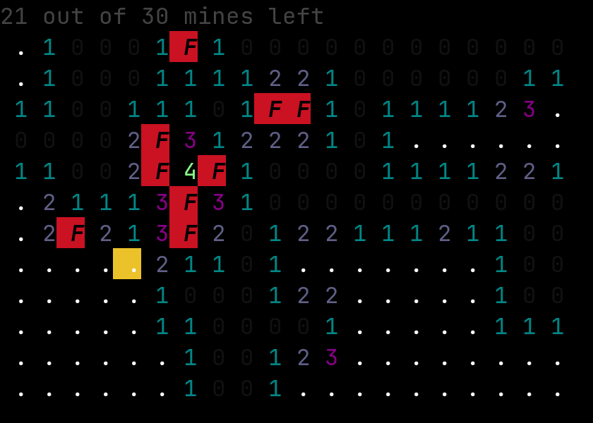
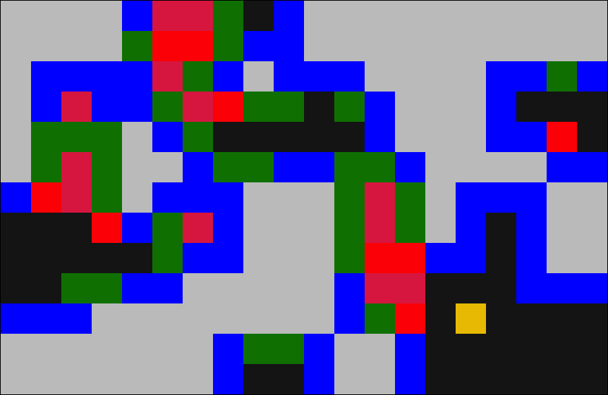

# Mine 

A minesweeper game with a terminal and graphical interface created by [Koen Westendorp](https://github.com/KoenWestendorp).



<!---->



## Installation

Go ahead and try out for yourself! :)

```zsh
git clone https://github.com/KoenWestendorp/mine.git
cd mine
cargo install --path .
```

## Usage

```zsh
mine-rs <SUBCOMMAND>
```

### Subcommands

`tui`
: Terminal interface for Mine.

`gui`
: Graphical interface for Mine.

`help`
: Prints help message or the help of the given subcommand.

### Flags

`--help`
: Prints help information.

`-V, --version`
: Prints version information.

`-w, --width <width>`
: Field width (default: 9)

`-h, --height <height>`
: Field height (default: 9)

`-m, --mines <mines>`
: The number of mines to be placed in the field (default: 10)

## Controls

### Movement 

&larr;, &darr;, &uarr;, &rarr;
: Arrows for cursor movement.

`h`, `j`, `k`, `l`
: Vim movement bindings!

`H`, `J`, `K`, `L`, `g`, `G`, `0`, `$`
: Move to edges.
: Note: `$` to move to the right edge of the field has not been implemented in the gui, yet.

### Actions

`f`, `<Space>`
: Flag selected cell.

`r`, `<Enter>`, `<Tab>`
: Reveal selected cell.
: Double-pressing will reveal around the cell if the correct number of flags is set around the cell.

`q`, `^C`
: Quit the program.

## Warning

Please note that the gui mode is still _extremely_ unstable, and hardly usable if you do not really know it. I am learning about this through making it. Sometimes, my display manager crashes, for example, because of resizing issues. Any ideas on improving this are _very_ welcome :)

## About

This program is written in [Rust](https://rust-lang.org). 
[structopt](https://crates.io/crates/structopt) is used for command line argument parsing, 
[console](https://crates.io/crates/console) for terminal utilities, and 
[winit](https://crates.io/crates/winit) for the gui.


Contributions very, very welcome :)
